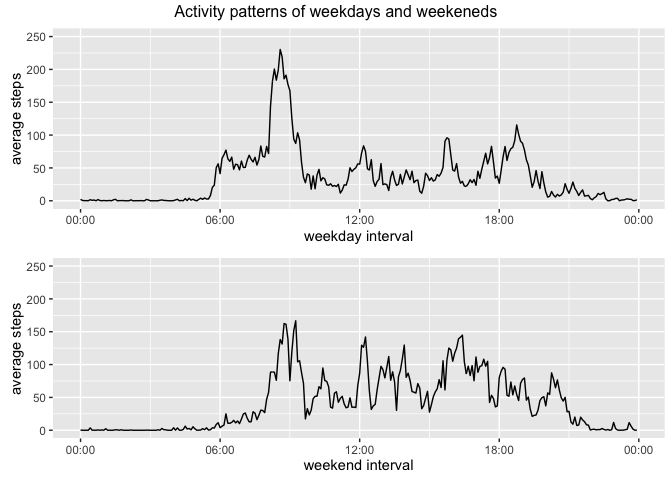

# Reproducible Research: Peer Assessment 1

## Loading and preprocessing the data

Load the data with dplyr and data.table package into a data table called activity.

```r
library(dplyr)
library(data.table)
activity<-fread("activity.csv")
```
The date has character type. Use lubridate to produce a POSIX typed date for further processing.

```r
library(lubridate)
activity<-mutate(activity,POSIXdate=activity[,date])
```

## What is mean total number of steps taken per day?

Use summarize function in dyplyr package to sum up steps variable, with activity grouped by dates, and store it into a new data table called stepsPerDay.

```r
stepsPerDay<-summarize(group_by(activity,date),steps=sum(steps,na.rm=T))
```

Data table stepsPerDay looks like this:

```
## Source: local data table [61 x 2]
## 
##          date steps
##         (chr) (int)
## 1  2012-10-01     0
## 2  2012-10-02   126
## 3  2012-10-03 11352
## 4  2012-10-04 12116
## 5  2012-10-05 13294
## 6  2012-10-06 15420
## 7  2012-10-07 11015
## 8  2012-10-08     0
## 9  2012-10-09 12811
## 10 2012-10-10  9900
## ..        ...   ...
```

Now we make a histogram of the total number of steps taken each day.

```r
library(ggplot2)
qplot(steps,data=stepsPerDay)
```


What is the mean and median then?


```r
mean(stepsPerDay$steps)
```

```
## [1] 9354.23
```

```r
median(stepsPerDay$steps)
```

```
## [1] 10395
```

## What is the average daily activity pattern?
First we need to compute the average steps taken for the same window of a day.
Here we treat NA as 0.


Then we will calculate the average steps taken for each time interval.

```r
library(tidyr)
byInterval<-spread(activity,interval,steps,fill=0)
meanInterval<-summarize_each(byInterval,funs(mean),-date,-POSIXdate)
```

We have calculated the mean. Now tidy up the data table and plot it out as a time-seires.

```r
meanInterval<-transpose(rbind(meanInterval,transpose(list(as.numeric(colnames(meanInterval))))))
meanInterval<-setcolorder(meanInterval,c(2,1))
colnames(meanInterval)<-c("interval","steps")
meanInterval$interval<-sprintf("%04d",as.numeric(meanInterval$interval))
meanInterval$interval<-parse_date_time(meanInterval$interval,"HM")

ggplot(meanInterval)+geom_line(aes(x=interval, y=steps))+scale_y_continuous()+scale_x_datetime(date_labels = "%H:%M")
```


The peak is certainly salient. Which interval was it?

```r
format(filter(meanInterval,steps=max(steps))$interval,format="%H:%M")
```

```
## [1] "14:50"
```

## Imputing missing values

Let's see how many incomplete observations there are in the original data set.

```r
nrow(activity)-length(which(complete.cases(activity)))
```

```
## [1] 2304
```

How do we deal with NA? One reasonable strategy is to fill it with the mean of the 5-minute interval calcualed without NA. If all data in the interval is NA, then it's set as 0.


```r
byIntervalNA<-spread(activity,interval,steps)
meanWithoutNA<-summarize_each(byIntervalNA,funs(mean(.,na.rm=T)),-date,-POSIXdate)
```

Copy the original, and then replace each NA with proper data.

```r
cpy<-select(activity,-date,-POSIXdate)
newsteps<-apply(cpy,1,function(x){
    steps=x[1]
    interval=x[2]
    interval<-as.character(interval)
    if (is.na(steps)){
        meanWithoutNA[[interval]]
    }
    else{
        x[1]
    }
})
cpy<-mutate(cpy,steps=newsteps)
cpy<-mutate(cpy,date=activity$date,POSIXdate=activity$POSIXdate)
```

Make a histogram of the total number of steps taken each day 

```r
stepsPerDay2<-summarize(group_by(cpy,POSIXdate),sum(steps))
qplot(stepsPerDay2[,`sum(steps)`],xlab = "Steps Per Day with NA imptued")
```


Compare the new graph with the old one, we can see that peak at 0 disappeared, and the distribution move towards the middle.

Mean and median of total number of steps taken per day:

```r
mean(stepsPerDay2$`sum(steps)`)
```

```
## [1] 10766.19
```

```r
median(stepsPerDay2$`sum(steps)`)
```

```
## [1] 10766.19
```

There are some days with all values as NA. So the whole day was filled with the average of existing values, which sum up to 10766.19. Mathematically it makes the mean 10766.19, and coincidentally the median became 10766.19 as well due to a good number of empty entries.

## Are there differences in activity patterns between weekdays and weekends?

Add a new column indicating weekday or weekend.


```r
cpy<-mutate(cpy,weekday=(wday(POSIXdate)%in%c(2,3,4,5,6)))
cpy<-mutate(cpy,interval=sprintf("%04d",cpy$interval))
cpy<-mutate(cpy,interval=parse_date_time(interval,"HM"))
```

Summarize weekday and weekend interval average. 

```r
weekday<-filter(cpy,weekday==T)
weekday<-summarize(group_by(weekday,interval),mean(steps))
weekend<-filter(cpy,weekday==F)
weekend<-summarize(group_by(weekend,interval),mean(steps))
```

Plot the two graphs together to see the difference.

```r
library(grid)
library(gridExtra)
p1<-ggplot()+geom_line(data=weekday,aes(x=`interval`,y=`mean(steps)`))+ylab("average steps")+xlab("weekday interval")+scale_x_datetime(date_labels = "%H:%M")+ylim(0,250)
p2<-ggplot()+geom_line(data=weekend,aes(x=`interval`,y=`mean(steps)`))+ylab("average steps")+xlab("weekend interval")+scale_x_datetime(date_labels = "%H:%M")+ylim(0,250)
grid.arrange(p1,p2,nrow=2,top="Activity patterns of weekdays and weekeneds")
```


